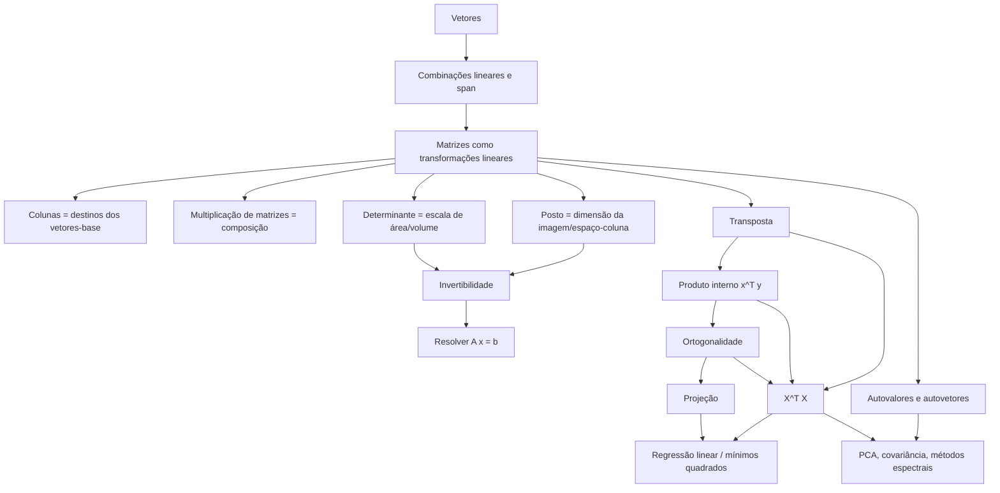
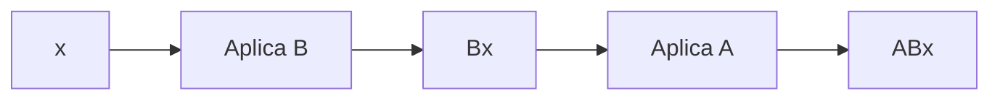
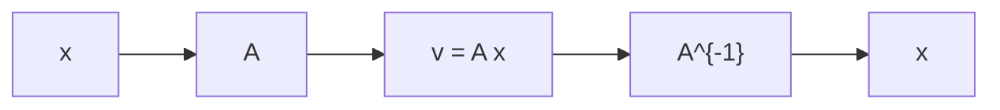
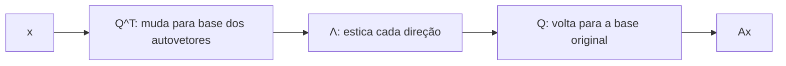
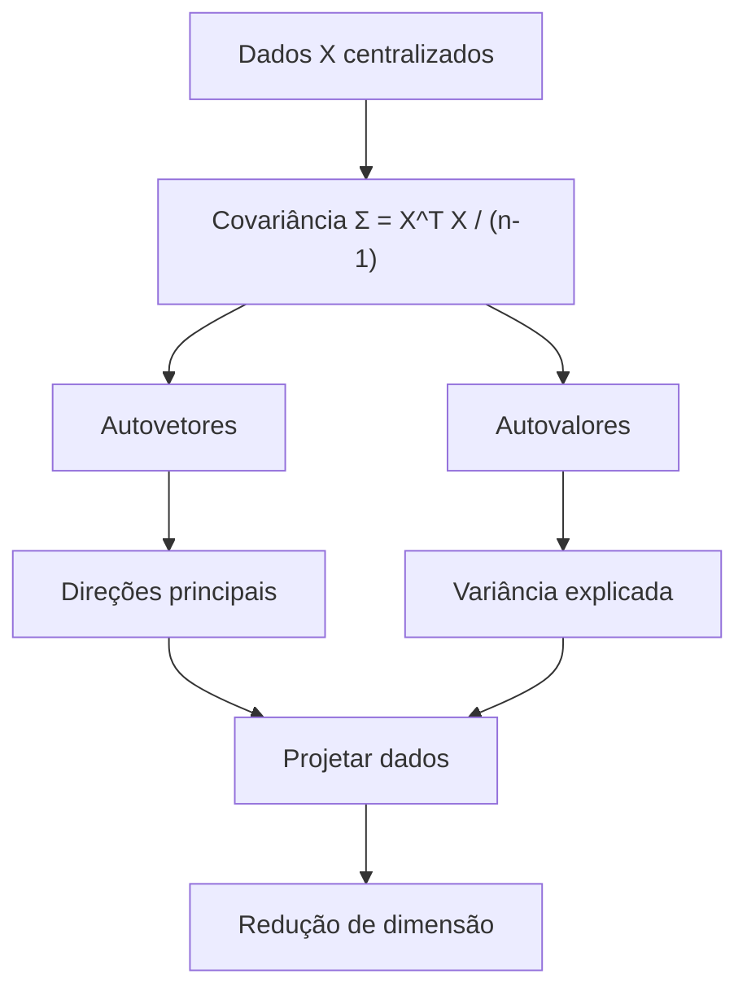
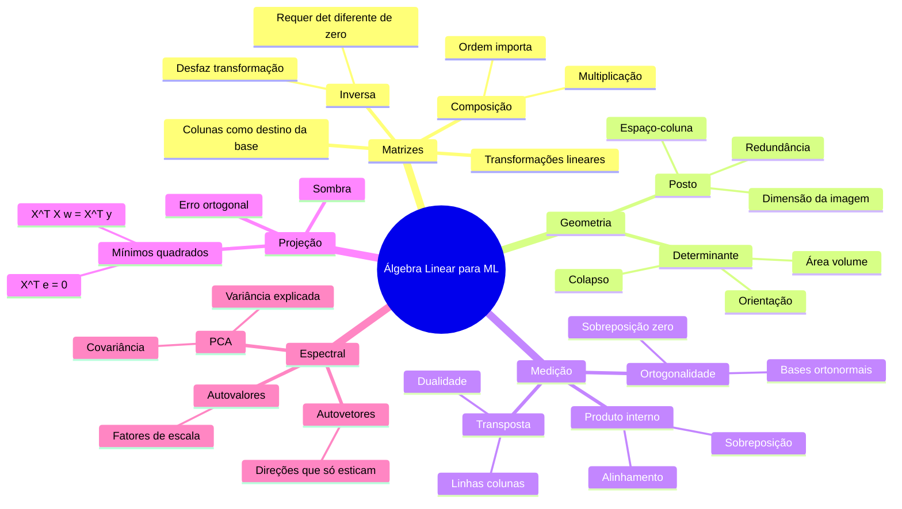

# Álgebra Linear para Machine Learning e Scientific ML

> **Objetivo deste README:** construir uma visão conectada de Álgebra Linear, sem “ponta solta”, ligando transformação linear, matriz, determinante, posto, transposta, produto interno, ortogonalidade, projeção, regressão linear, PCA e autovalores/autovetores.

---

## 0. A grande ideia

Álgebra Linear é a linguagem matemática para responder a uma pergunta central:

> **Como objetos lineares transformam, medem, combinam, comprimem e revelam estrutura em dados?**

Em Machine Learning, quase tudo passa por isso:

- uma camada linear de rede neural é uma transformação \(Wx\);
- regressão linear é uma projeção no espaço-coluna de \(X\);
- PCA encontra direções principais via autovalores/autovetores;
- covariância é uma matriz simétrica que mede como variáveis variam juntas;
- regularização controla problemas de posto, redundância e instabilidade;
- SVD generaliza a ideia espectral para qualquer matriz.

A história completa pode ser vista assim:



O fio condutor é:

> **Matrizes transformam o espaço. Produto interno mede alinhamento. Ortogonalidade diz quando não há sobreposição. Projeção encontra a melhor aproximação. Autovalores revelam direções naturais da transformação.**

---

# Parte I — Vetores, span e transformação linear

## 1. Vetores: objetos geométricos e objetos de dados

Um vetor pode ser visto de duas formas equivalentes:

### 1.1 Vetor como seta

Em geometria, um vetor é uma seta com:

- direção;
- sentido;
- magnitude.

Exemplo:

\[
v =
\begin{bmatrix}
3 \\
2
\end{bmatrix}
\]

representa uma seta que anda 3 unidades no eixo \(x\) e 2 unidades no eixo \(y\).

### 1.2 Vetor como lista de atributos

Em ML, um vetor pode representar uma observação:

\[
x =
\begin{bmatrix}
\text{idade} \\
\text{renda} \\
\text{score} \\
\text{gasto médio}
\end{bmatrix}
\]

Ou seja: o mesmo objeto matemático pode ser uma seta no espaço ou uma linha de dados.

Essa dupla interpretação é essencial:

> **Geometricamente:** vetores vivem em espaços.  
> **Em ML:** dados vivem em espaços vetoriais.

---

## 2. Combinação linear e span

Uma combinação linear de vetores é uma soma ponderada:

\[
c_1v_1 + c_2v_2 + \dots + c_kv_k
\]

O **span** de um conjunto de vetores é o conjunto de todos os vetores que podem ser gerados por combinações lineares deles:

\[
\text{span}(v_1, v_2, \dots, v_k)
\]

### Exemplo

Se:

\[
v_1 =
\begin{bmatrix}
1 \\
0
\end{bmatrix},
\quad
v_2 =
\begin{bmatrix}
0 \\
1
\end{bmatrix}
\]

então:

\[
\text{span}(v_1, v_2) = \mathbb{R}^2
\]

porque qualquer vetor do plano pode ser escrito como:

\[
\begin{bmatrix}
x \\
y
\end{bmatrix}
=
x
\begin{bmatrix}
1 \\
0
\end{bmatrix}
+
y
\begin{bmatrix}
0 \\
1
\end{bmatrix}
\]

### Conexão com ML

Se \(X\) é uma matriz de dados, suas colunas são features. O espaço-coluna de \(X\) contém todas as combinações lineares possíveis dessas features.

Quando fazemos regressão linear:

\[
\hat{y} = Xw
\]

estamos dizendo:

> A previsão \(\hat{y}\) precisa morar no espaço gerado pelas colunas de \(X\).

Isso será a base da projeção e dos mínimos quadrados.

---

## 3. Transformação linear

Uma transformação linear é uma função entre espaços vetoriais que preserva a estrutura linear.

Formalmente, uma transformação \(T\) é linear se satisfaz:

### 3.1 Aditividade

\[
T(u + v) = T(u) + T(v)
\]

### 3.2 Homogeneidade

\[
T(cu) = cT(u)
\]

Juntas, essas duas propriedades dizem:

\[
T(c_1v_1 + c_2v_2) = c_1T(v_1) + c_2T(v_2)
\]

Ou seja:

> Transformações lineares respeitam combinações lineares.

---

## 4. Matriz como transformação

Uma matriz não é só uma tabela de números. Ela representa uma transformação linear.

Se:

\[
A =
\begin{bmatrix}
2 & 1 \\
1 & 2
\end{bmatrix}
\]

então aplicar \(A\) a um vetor \(x\) significa transformar esse vetor:

\[
Ax =
\begin{bmatrix}
2 & 1 \\
1 & 2
\end{bmatrix}
\begin{bmatrix}
x_1 \\
x_2
\end{bmatrix}
=
\begin{bmatrix}
2x_1 + x_2 \\
x_1 + 2x_2
\end{bmatrix}
\]

### 4.1 As colunas dizem para onde vão os vetores-base

Os vetores-base canônicos em \(\mathbb{R}^2\) são:

\[
\hat{i} =
\begin{bmatrix}
1 \\
0
\end{bmatrix},
\quad
\hat{j} =
\begin{bmatrix}
0 \\
1
\end{bmatrix}
\]

Aplicando \(A\):

\[
A\hat{i}
=
\begin{bmatrix}
2 \\
1
\end{bmatrix}
\]

\[
A\hat{j}
=
\begin{bmatrix}
1 \\
2
\end{bmatrix}
\]

Esses resultados são exatamente as colunas de \(A\).

Logo:

\[
A =
\begin{bmatrix}
| & | \\
A\hat{i} & A\hat{j} \\
| & |
\end{bmatrix}
\]

> **As colunas da matriz são os destinos dos vetores-base.**

Essa é uma das ideias mais importantes de toda Álgebra Linear.

---

## 5. Por que \(Wx + b\) não é linear?

Em ML, aparece muito:

\[
f(x) = Wx + b
\]

Essa transformação é chamada **afim**, não linear.

Por quê?

Porque uma transformação linear precisa preservar a origem:

\[
T(0) = 0
\]

Mas:

\[
f(0) = W0 + b = b
\]

Se \(b \neq 0\), a origem vai para \(b\), não para zero.

Então:

- \(Wx\) é linear;
- \(Wx + b\) é afim;
- o bias \(b\) desloca a transformação.

### Conexão com redes neurais

Uma camada densa geralmente faz:

\[
z = Wx + b
\]

Depois aplica uma não-linearidade:

\[
a = \sigma(z)
\]

Sem o bias, a camada ficaria presa a transformações que mantêm a origem fixa. Com o bias, ela ganha liberdade para deslocar hiperplanos de decisão.

---

# Parte II — Multiplicação de matrizes como composição

## 6. Multiplicação de matrizes

A multiplicação de matrizes tem duas interpretações complementares:

1. mecânica linha-coluna;
2. composição de transformações.

A interpretação geométrica é a mais importante.

---

## 7. Composição de transformações

Se \(A\) e \(B\) são matrizes, então:

\[
(AB)x = A(Bx)
\]

Isso significa:

> Primeiro aplicamos \(B\), depois aplicamos \(A\).

A leitura é da direita para a esquerda.



Logo:

\[
AB
\]

representa a transformação composta:

\[
B \text{ primeiro, } A \text{ depois.}
\]

---

## 8. Mecânica linha-coluna

Se:

\[
A =
\begin{bmatrix}
a_{11} & a_{12} \\
a_{21} & a_{22}
\end{bmatrix},
\quad
B =
\begin{bmatrix}
b_{11} & b_{12} \\
b_{21} & b_{22}
\end{bmatrix}
\]

então:

\[
AB =
\begin{bmatrix}
a_{11}b_{11} + a_{12}b_{21}
&
a_{11}b_{12} + a_{12}b_{22}
\\
a_{21}b_{11} + a_{22}b_{21}
&
a_{21}b_{12} + a_{22}b_{22}
\end{bmatrix}
\]

Cada entrada é um produto interno entre:

- uma linha de \(A\);
- uma coluna de \(B\).

Ou seja:

\[
(AB)_{ij} = \text{linha } i \text{ de } A \cdot \text{coluna } j \text{ de } B
\]

---

## 9. Por que matriz não comuta?

Em geral:

\[
AB \neq BA
\]

Porque mudar a ordem muda a composição.

Exemplo intuitivo:

1. girar e depois esticar;
2. esticar e depois girar.

Essas operações podem produzir resultados diferentes.

### Exemplo numérico

Considere:

\[
A =
\begin{bmatrix}
2 & 0 \\
0 & 1
\end{bmatrix}
\]

um esticamento no eixo \(x\), e:

\[
B =
\begin{bmatrix}
0 & -1 \\
1 & 0
\end{bmatrix}
\]

uma rotação de \(90^\circ\).

Então \(AB\) e \(BA\) geralmente não produzem o mesmo efeito.

> A ordem das transformações importa porque a geometria intermediária muda.

### Conexão com ML

Em redes neurais profundas:

\[
W_3 W_2 W_1 x
\]

a ordem das camadas importa. Trocar duas matrizes muda completamente a função aprendida.

---

# Parte III — Determinante, posto, espaço-coluna e inversa

## 10. Determinante

O determinante mede quanto uma transformação linear escala área, volume ou hipervolume.

Em 2D:

\[
|\det(A)|
\]

mede o fator de escala de área.

Em 3D:

\[
|\det(A)|
\]

mede o fator de escala de volume.

O sinal indica orientação:

- \(\det(A) > 0\): preserva orientação;
- \(\det(A) < 0\): inverte orientação;
- \(\det(A) = 0\): colapsa o espaço em dimensão menor.

---

## 11. Exemplo de determinante

Se:

\[
A =
\begin{bmatrix}
2 & 0 \\
0 & 3
\end{bmatrix}
\]

então:

\[
\det(A) = 6
\]

A transformação estica o eixo \(x\) por 2 e o eixo \(y\) por 3. A área escala por:

\[
2 \cdot 3 = 6
\]

Se um quadrado tinha área 1, depois da transformação vira um retângulo de área 6.

---

## 12. Determinante zero

Se:

\[
A =
\begin{bmatrix}
1 & 2 \\
2 & 4
\end{bmatrix}
\]

as colunas são dependentes:

\[
\begin{bmatrix}
2 \\
4
\end{bmatrix}
=
2
\begin{bmatrix}
1 \\
2
\end{bmatrix}
\]

Então o plano é colapsado numa linha.

\[
\det(A) = 0
\]

Interpretação:

> A matriz perdeu uma dimensão. O espaço foi esmagado. A transformação não pode ser desfeita.

---

## 13. Espaço-coluna

O espaço-coluna de uma matriz \(A\), escrito \(\text{col}(A)\), é o span de suas colunas.

Se:

\[
A =
\begin{bmatrix}
| & | \\
a_1 & a_2 \\
| & |
\end{bmatrix}
\]

então:

\[
\text{col}(A) = \text{span}(a_1, a_2)
\]

É o conjunto de todos os vetores que podem ser escritos como:

\[
Ax
\]

para algum vetor \(x\).

Logo:

> O espaço-coluna é a imagem da transformação.

---

## 14. Posto

O posto, ou rank, é a dimensão do espaço-coluna:

\[
\text{rank}(A) = \dim(\text{col}(A))
\]

Em linguagem geométrica:

- posto 2 em \(\mathbb{R}^2\): a matriz preenche o plano;
- posto 1 em \(\mathbb{R}^2\): a matriz colapsa tudo numa linha;
- posto 0: tudo vai para zero.

Em \(\mathbb{R}^3\):

- posto 3: preenche volume;
- posto 2: colapsa num plano;
- posto 1: colapsa numa linha;
- posto 0: colapsa na origem.

---

## 15. Triângulo fundamental: posto, determinante e inversa

Para matrizes quadradas \(n \times n\), estas ideias se conectam:

```mermaid
flowchart TD
    A[Posto cheio: rank(A) = n] <--> B[det(A) diferente de 0]
    B <--> C[A é invertível]
    C <--> D["A x = b tem solução única para todo b"]
    D <--> A
```

Ou seja:

\[
\boxed{
\text{posto cheio}
\Longleftrightarrow
\det(A) \neq 0
\Longleftrightarrow
A^{-1} \text{ existe}
}
\]

### Interpretação geométrica

Se \(\det(A) \neq 0\), a matriz não colapsa o espaço.  
Se ela não colapsa o espaço, cada ponto transformado veio de um único ponto original.  
Se cada ponto tem origem única, dá para desfazer a transformação.  
Logo, existe inversa.

---

## 16. Inversa

A inversa de \(A\), escrita \(A^{-1}\), é a transformação que desfaz \(A\).

\[
A^{-1} A = I
\]

\[
A A^{-1} = I
\]

Se:

\[
v = A x
\]

então:

\[
x = A^{-1} v
\]

### Interpretação

- \(A\) leva \(x\) até \(v\);
- \(A^{-1}\) leva \(v\) de volta até \(x\).



---

## 17. Quando não existe inversa?

A inversa não existe quando \(A\) colapsa dimensões.

Se dois vetores diferentes vão para o mesmo lugar, não dá para saber de onde o resultado veio.

Exemplo:

\[
A =
\begin{bmatrix}
1 & 2 \\
2 & 4
\end{bmatrix}
\]

Como as colunas são dependentes, o plano vira uma linha.

Então várias entradas diferentes podem gerar a mesma saída.

A transformação perde informação.

> Sem informação suficiente, não existe desfazer único.

---

# Parte IV — Transposta, dualidade e produto interno

## 18. Transposta

A transposta de uma matriz troca linhas por colunas.

Se:

\[
A =
\begin{bmatrix}
1 & 2 \\
3 & 4
\end{bmatrix}
\]

então:

\[
A^T =
\begin{bmatrix}
1 & 3 \\
2 & 4
\end{bmatrix}
\]

Geometricamente, em termos de tabela, parece um “espelho pela diagonal principal”.

---

## 19. Matriz simétrica

Uma matriz é simétrica se:

\[
A = A^T
\]

Exemplo:

\[
A =
\begin{bmatrix}
2 & 1 \\
1 & 3
\end{bmatrix}
\]

é simétrica.

Matrizes simétricas aparecem muito em ML:

- matriz de covariância;
- kernel matrix;
- Hessiana;
- \(X^T X\).

### Por que \(X^T X\) é simétrica?

\[
(X^T X)^T = X^T (X^T)^T = X^T X
\]

Logo, \(X^T X\) é sempre simétrica.

Isso importa porque matrizes simétricas têm propriedades espectrais muito boas:

- autovalores reais;
- autovetores ortogonais;
- decomposição espectral limpa;
- conexão direta com PCA.

---

## 20. Transposta de produto

A transposta de um produto inverte a ordem:

\[
(AB)^T = B^T A^T
\]

Por quê?

Porque \(AB\) significa:

> primeiro \(B\), depois \(A\).

Ao transpor, a ação “volta” atravessando as transformações na ordem inversa.

### Conexão com backprop

Em redes neurais, durante o forward pass aparecem multiplicações por matrizes. No backward pass, gradientes frequentemente passam por transpostas.

A inversão da ordem é uma sombra algébrica da regra da cadeia.

---

## 21. Dualidade: vetor como seta e como medidor

Um vetor coluna:

\[
x =
\begin{bmatrix}
x_1 \\
x_2
\end{bmatrix}
\]

pode ser visto como uma seta.

Sua transposta:

\[
x^T =
\begin{bmatrix}
x_1 & x_2
\end{bmatrix}
\]

pode ser vista como uma transformação que recebe outro vetor e devolve um número:

\[
x^T y
\]

Ou seja:

\[
x^T : \mathbb{R}^n \to \mathbb{R}
\]

> A transposta transforma um vetor-seta em uma máquina de medir alinhamento.

Essa é a ponte para produto interno.

---

## 22. Produto interno

O produto interno padrão entre \(x\) e \(y\) é:

\[
x^T y
\]

Se:

\[
x =
\begin{bmatrix}
x_1 \\
x_2
\end{bmatrix},
\quad
y =
\begin{bmatrix}
y_1 \\
y_2
\end{bmatrix}
\]

então:

\[
x^T y = x_1 y_1 + x_2 y_2
\]

Geometricamente:

\[
x^T y = \|x\| \|y\| \cos(\theta)
\]

Portanto, o produto interno mede:

- alinhamento;
- sobreposição;
- quanto um vetor aponta na direção do outro.

---

## 23. Interpretação do produto interno

\[
x^T y
\]

pode ser lido como:

> O vetor \(x\), transformado em medidor \(x^T\), mede quanto de \(y\) existe na direção de \(x\).

Casos importantes:

### Mesmo sentido

Se \(\theta = 0^\circ\):

\[
\cos(0) = 1
\]

\[
x^T y = \|x\| \|y\|
\]

Máxima sobreposição positiva.

### Perpendicular

Se \(\theta = 90^\circ\):

\[
\cos(90^\circ) = 0
\]

\[
x^T y = 0
\]

Sem sobreposição.

### Sentidos opostos

Se \(\theta = 180^\circ\):

\[
\cos(180^\circ) = -1
\]

\[
x^T y = -\|x\| \|y\|
\]

Sobreposição negativa.

---

# Parte V — Ortogonalidade

## 24. Ortogonalidade

Dois vetores são ortogonais quando seu produto interno é zero:

\[
x^T y = 0
\]

Geometricamente, isso significa que eles são perpendiculares.

Mas a interpretação mais profunda é:

> Um vetor não tem componente na direção do outro.

Ou:

> Um vetor não “explica” nada do outro naquela direção.

---

## 25. Ortogonalidade como informação não-redundante

Se dois vetores estão muito alinhados, eles carregam informação parecida.

Se:

\[
x^T y
\]

é grande, existe muita sobreposição.

Se:

\[
x^T y = 0
\]

não existe sobreposição linear.

Então, em linguagem de ML:

> Direções ortogonais representam aspectos não-redundantes do espaço.

Cuidado: ortogonalidade não é exatamente o mesmo que independência estatística.  
Mas, em contextos lineares, ela representa ausência de redundância linear.

### Conexão com features

Se duas features são muito correlacionadas, elas apontam em direções parecidas no espaço das observações.

Isso causa redundância.

Em regressão, redundância entre colunas de \(X\) aparece como multicolinearidade.

---

## 26. Bases ortonormais

Uma base ortonormal é um conjunto de vetores que são:

1. ortogonais entre si;
2. unitários.

Formalmente:

\[
q_i^T q_j =
\begin{cases}
1, & i=j \\
0, & i\neq j
\end{cases}
\]

Em matriz:

\[
Q^T Q = I
\]

Isso significa que as colunas de \(Q\) formam uma base ortonormal.

### Por que isso é tão bom?

Porque em uma base ortonormal:

- medir coordenadas é fácil;
- projetar é fácil;
- distâncias são preservadas;
- ângulos são preservados;
- redundância é minimizada.

---

## 27. Matriz ortogonal

Uma matriz \(Q\) é ortogonal se:

\[
Q^T Q = I
\]

Isso implica:

\[
Q^{-1} = Q^T
\]

Ou seja:

> Para desfazer uma matriz ortogonal, basta transpor.

Geometricamente, matrizes ortogonais representam rotações e reflexões.

Elas não esticam nem comprimem o espaço. Apenas mudam a orientação.

---

## 28. Ortogonalidade e \(X^T X\)

Se \(X\) tem colunas \(x_1, x_2, \dots, x_p\), então:

\[
X^T X =
\begin{bmatrix}
x_1^T x_1 & x_1^T x_2 & \cdots & x_1^T x_p \\
x_2^T x_1 & x_2^T x_2 & \cdots & x_2^T x_p \\
\vdots & \vdots & \ddots & \vdots \\
x_p^T x_1 & x_p^T x_2 & \cdots & x_p^T x_p
\end{bmatrix}
\]

Ou seja, \(X^T X\) é uma matriz de produtos internos entre features.

Na diagonal:

\[
x_i^T x_i = \|x_i\|^2
\]

Fora da diagonal:

\[
x_i^T x_j
\]

mede a sobreposição entre features.

### Interpretação

- Se as colunas são ortogonais, \(X^T X\) é diagonal.
- Se as colunas são ortonormais, \(X^T X = I\).
- Se as colunas são redundantes, \(X^T X\) fica mal condicionado ou singular.

Isso conecta:


---

# Parte VI — Produto vetorial como enriquecimento

## 29. Produto vetorial

O produto vetorial é uma operação específica de \(\mathbb{R}^3\):

\[
a \times b
\]

Ele devolve um vetor perpendicular a \(a\) e \(b\).

### Magnitude

\[
\|a \times b\| = \|a\|\|b\|\sin(\theta)
\]

Essa magnitude é a área do paralelogramo formado por \(a\) e \(b\).

### Direção

A direção é dada pela regra da mão direita.

### Relação com determinante

O produto vetorial se conecta com orientação e área, assim como o determinante.

Mas para ML, ele é menos central que:

- produto interno;
- projeção;
- decomposição espectral;
- SVD.

> Produto vetorial é enriquecimento geométrico. Produto interno é ferramenta central para ML.

---

# Parte VII — Projeção

## 30. A ideia de projeção

Projeção responde:

> Quanto de um vetor mora na direção de outro?

Se temos um vetor \(b\) e queremos projetá-lo na direção de \(a\), buscamos a sombra de \(b\) sobre a linha gerada por \(a\):

\[
\text{span}(a)
\]

A projeção precisa estar nessa linha, então ela é um múltiplo de \(a\):

\[
\text{proj}_a(b) = \hat{x} a
\]

A pergunta vira:

> Qual é o número \(\hat{x}\)?

---

## 31. A condição geométrica da projeção

O erro entre \(b\) e sua projeção é:

\[
e = b - \hat{x} a
\]

A projeção correta é aquela em que o erro é perpendicular à linha.

Ou seja:

\[
a^T e = 0
\]

Substituindo \(e\):

\[
a^T(b - \hat{x} a) = 0
\]

Abrindo:

\[
a^T b - \hat{x} a^T a = 0
\]

Logo:

\[
\hat{x} = \frac{a^T b}{a^T a}
\]

E portanto:

\[
\boxed{
\text{proj}_a(b) =
\frac{a^T b}{a^T a} a
}
\]

---

## 32. Interpretação da fórmula

\[
\text{proj}_a(b) =
\frac{a^T b}{a^T a} a
\]

Peça por peça:

### Numerador

\[
a^T b
\]

mede a sobreposição de \(b\) na direção de \(a\).

### Denominador

\[
a^T a = \|a\|^2
\]

normaliza pelo tamanho de \(a\).

### Multiplicação final por \(a\)

Transforma o coeficiente escalar de volta em vetor.

---

## 33. Caso especial: vetor unitário

Se \(a\) é unitário:

\[
\|a\| = 1
\]

então:

\[
a^T a = 1
\]

e a projeção vira:

\[
\text{proj}_a(b) = (a^T b)a
\]

Muito mais simples.

Por isso bases ortonormais são tão poderosas.

---

## 34. Exemplo numérico de projeção

Se:

\[
a =
\begin{bmatrix}
2 \\
1
\end{bmatrix},
\quad
b =
\begin{bmatrix}
3 \\
4
\end{bmatrix}
\]

então:

\[
a^T b = 2 \cdot 3 + 1 \cdot 4 = 10
\]

\[
a^T a = 2^2 + 1^2 = 5
\]

\[
\hat{x} = \frac{10}{5} = 2
\]

Logo:

\[
\text{proj}_a(b) = 2a =
\begin{bmatrix}
4 \\
2
\end{bmatrix}
\]

O erro é:

\[
e = b - \text{proj}_a(b)
=
\begin{bmatrix}
3 \\
4
\end{bmatrix}
-
\begin{bmatrix}
4 \\
2
\end{bmatrix}
=
\begin{bmatrix}
-1 \\
2
\end{bmatrix}
\]

Verificando ortogonalidade:

\[
a^T e =
\begin{bmatrix}
2 & 1
\end{bmatrix}
\begin{bmatrix}
-1 \\
2
\end{bmatrix}
=
-2 + 2 = 0
\]

O erro é perpendicular à direção de \(a\).

---

# Parte VIII — Mínimos quadrados como projeção

## 35. De uma linha para um subespaço

Na projeção sobre uma única direção:

\[
\text{proj}_a(b) = \hat{x} a
\]

Na regressão linear, projetamos sobre o espaço-coluna de uma matriz \(X\).

A previsão é:

\[
\hat{y} = X\hat{w}
\]

Isso significa:

> \(\hat{y}\) é uma combinação linear das colunas de \(X\).

Logo:

\[
\hat{y} \in \text{col}(X)
\]

---

## 36. O erro na regressão

O vetor alvo é \(y\), ou \(b\).

A previsão é:

\[
X\hat{w}
\]

O erro/resíduo é:

\[
e = y - X\hat{w}
\]

O melhor ajuste de mínimos quadrados é aquele em que esse erro tem o menor comprimento possível.

Geometricamente, isso ocorre quando o erro é ortogonal ao espaço-coluna de \(X\).

---

## 37. Condição de ortogonalidade

O erro deve ser ortogonal a todas as colunas de \(X\).

Se \(X\) tem colunas \(x_1, x_2, \dots, x_p\), queremos:

\[
x_1^T e = 0
\]

\[
x_2^T e = 0
\]

\[
\vdots
\]

\[
x_p^T e = 0
\]

Escrevendo tudo de uma vez:

\[
X^T e = 0
\]

Substituindo \(e = y - X\hat{w}\):

\[
X^T (y - X\hat{w}) = 0
\]

Abrindo:

\[
X^T y - X^T X \hat{w} = 0
\]

Logo:

\[
\boxed{
X^T X \hat{w} = X^T y
}
\]

Essa é a equação normal.

---

## 38. Por que \(X^T X\) aparece?

Porque \(X^T\) está medindo o erro contra cada coluna de \(X\).

\[
X^T e = 0
\]

é a forma compacta de dizer:

> Nenhuma feature consegue explicar o resíduo restante.

Quando abrimos:

\[
X^T (y - X\hat{w}) = 0
\]

surge:

\[
X^T X \hat{w} = X^T y
\]

Então \(X^T X\) não é uma fórmula mágica.

É a matriz que contém os produtos internos entre as colunas de \(X\).

---

## 39. Ligação entre projeção e regressão

```mermaid
flowchart TD
    A[Produto interno mede sobreposição] --> B[Ortogonalidade = sobreposição zero]
    B --> C[Projeção = erro ortogonal ao subespaço]
    C --> D[Regressão linear = projeção de y em col(X)]
    D --> E["X^T e = 0"]
    E --> F["X^T X w = X^T y"]
```

Em palavras:

> Regressão linear escolhe \(\hat{w}\) de modo que \(X\hat{w}\) seja a sombra de \(y\) no espaço das previsões possíveis.

---

## 40. Quando a solução existe e é única?

A equação normal é:

\[
X^T X \hat{w} = X^T y
\]

Se \(X^T X\) é invertível:

\[
\hat{w} = (X^T X)^{-1} X^T y
\]

Mas \(X^T X\) só é invertível se as colunas de \(X\) forem linearmente independentes.

Se houver redundância entre features, \(X^T X\) fica singular ou quase singular.

### Conexão com multicolinearidade

Features redundantes significam:

- colunas quase alinhadas;
- produtos internos altos fora da diagonal de \(X^T X\);
- posto deficiente ou quase deficiente;
- inversa instável;
- coeficientes que explodem.

Aqui reaparecem:

- produto interno;
- ortogonalidade;
- posto;
- determinante;
- inversa;
- espaço-coluna.

Tudo se conecta.

---

# Parte IX — Autovalores e autovetores

## 41. A ideia central

Autovetores são direções especiais de uma transformação.

Uma matriz \(A\) geralmente move um vetor para outra direção.

Mas, para certos vetores \(v\), a matriz só estica, comprime ou inverte a direção:

\[
Av = \lambda v
\]

Aqui:

- \(v\) é um autovetor;
- \(\lambda\) é o autovalor.

---

## 42. Interpretação geométrica

A equação:

\[
Av = \lambda v
\]

diz:

> Depois da transformação \(A\), o vetor continua na mesma linha.

Se:

- \(\lambda > 1\): estica;
- \(0 < \lambda < 1\): comprime;
- \(\lambda = 1\): mantém;
- \(\lambda = 0\): colapsa;
- \(\lambda < 0\): inverte o sentido.

---

## 43. Exemplo simples

Se:

\[
A =
\begin{bmatrix}
3 & 0 \\
0 & 2
\end{bmatrix}
\]

então:

\[
A
\begin{bmatrix}
1 \\
0
\end{bmatrix}
=
\begin{bmatrix}
3 \\
0
\end{bmatrix}
=
3
\begin{bmatrix}
1 \\
0
\end{bmatrix}
\]

Logo:

\[
\begin{bmatrix}
1 \\
0
\end{bmatrix}
\]

é autovetor com autovalor 3.

Também:

\[
A
\begin{bmatrix}
0 \\
1
\end{bmatrix}
=
\begin{bmatrix}
0 \\
2
\end{bmatrix}
=
2
\begin{bmatrix}
0 \\
1
\end{bmatrix}
\]

Logo:

\[
\begin{bmatrix}
0 \\
1
\end{bmatrix}
\]

é autovetor com autovalor 2.

---

## 44. Como autovalores se conectam com determinante?

Da equação:

\[
Av = \lambda v
\]

temos:

\[
Av - \lambda v = 0
\]

\[
(A - \lambda I)v = 0
\]

Para existir solução não trivial \(v \neq 0\), a matriz \(A - \lambda I\) precisa colapsar alguma direção.

Então:

\[
\det(A - \lambda I) = 0
\]

Essa equação encontra os autovalores.

Interpretação:

> Procuramos valores de \(\lambda\) tais que \(A - \lambda I\) perca posto.

Isso conecta autovalores diretamente com:

- determinante;
- posto;
- colapso;
- espaço nulo;
- direções preservadas.

---

## 45. Autovalores e matrizes simétricas

Matrizes simétricas são especialmente importantes.

Se:

\[
A = A^T
\]

então:

- seus autovalores são reais;
- seus autovetores associados a autovalores distintos são ortogonais;
- ela pode ser decomposta como:

\[
A = Q\Lambda Q^T
\]

onde:

- \(Q\) contém autovetores ortonormais;
- \(\Lambda\) contém autovalores na diagonal.

Essa decomposição diz:



Ou seja:

> Uma matriz simétrica pode ser entendida como: girar/refletir para uma base especial, esticar cada eixo, e voltar.

---

## 46. Covariância e PCA

Em PCA, começamos com uma matriz de dados centralizada \(X\).

A matriz de covariância é proporcional a:

\[
X^T X
\]

Mais precisamente:

\[
\Sigma = \frac{1}{n - 1} X^T X
\]

Essa matriz mede como as features variam juntas.

Como \(\Sigma\) é simétrica, podemos estudar seus autovalores e autovetores.

### Interpretação

- autovetores da covariância = direções principais de variação;
- autovalores = quantidade de variância naquela direção.

PCA escolhe as direções ortogonais que capturam mais variância.

---

## 47. PCA como rotação para uma base melhor

A ideia de PCA:

1. encontrar direções ortogonais de máxima variância;
2. ordenar essas direções por importância;
3. projetar os dados nessas direções;
4. opcionalmente descartar dimensões menos importantes.



PCA conecta quase tudo deste README:

- produto interno: \(X^T X\);
- transposta: \(X^T\);
- ortogonalidade: componentes principais são ortogonais;
- projeção: dados são projetados nas componentes;
- autovalores/autovetores: direções principais;
- posto: número máximo de componentes úteis;
- determinante: volume/colapso;
- matriz simétrica: covariância.

---

# Parte X — Um exemplo único conectando tudo

Considere:

\[
A =
\begin{bmatrix}
2 & 1 \\
1 & 2
\end{bmatrix}
\]

## 48. Matriz como transformação

As colunas são:

\[
a_1 =
\begin{bmatrix}
2 \\
1
\end{bmatrix},
\quad
a_2 =
\begin{bmatrix}
1 \\
2
\end{bmatrix}
\]

Logo:

- \(\hat{i}\) vai para \((2,1)\);
- \(\hat{j}\) vai para \((1,2)\).

A matriz transforma a grade do plano levando os vetores-base para essas colunas.

---

## 49. Determinante

\[
\det(A) = 2 \cdot 2 - 1 \cdot 1 = 3
\]

Logo:

- áreas são multiplicadas por 3;
- a orientação é preservada;
- a transformação não colapsa;
- \(A\) é invertível.

---

## 50. Posto e espaço-coluna

Como \(\det(A) \neq 0\), as colunas são independentes.

Logo:

\[
\text{rank}(A) = 2
\]

e:

\[
\text{col}(A) = \mathbb{R}^2
\]

O espaço-coluna é o plano todo.

---

## 51. Inversa

Como \(\det(A) = 3\), existe inversa.

\[
A^{-1}
=
\frac{1}{3}
\begin{bmatrix}
2 & -1 \\
-1 & 2
\end{bmatrix}
\]

Se:

\[
v = A x
\]

então:

\[
x = A^{-1} v
\]

A transformação pode ser desfeita.

---

## 52. Transposta e simetria

\[
A^T =
\begin{bmatrix}
2 & 1 \\
1 & 2
\end{bmatrix}
= A
\]

Logo, \(A\) é simétrica.

Isso sugere que ela terá autovetores ortogonais e autovalores reais.

---

## 53. Autovalores e autovetores

Teste:

\[
v_1 =
\begin{bmatrix}
1 \\
1
\end{bmatrix}
\]

\[
Av_1 =
\begin{bmatrix}
3 \\
3
\end{bmatrix}
=
3
\begin{bmatrix}
1 \\
1
\end{bmatrix}
\]

Logo, \(v_1\) é autovetor com autovalor 3.

Agora:

\[
v_2 =
\begin{bmatrix}
1 \\
-1
\end{bmatrix}
\]

\[
Av_2 =
\begin{bmatrix}
1 \\
-1
\end{bmatrix}
=
1
\begin{bmatrix}
1 \\
-1
\end{bmatrix}
\]

Logo, \(v_2\) é autovetor com autovalor 1.

Observe:

\[
v_1^T v_2 =
\begin{bmatrix}
1 & 1
\end{bmatrix}
\begin{bmatrix}
1 \\
-1
\end{bmatrix}
= 0
\]

Os autovetores são ortogonais.

---

## 54. Determinante via autovalores

Os autovalores são:

\[
\lambda_1 = 3,
\quad
\lambda_2 = 1
\]

O determinante é o produto dos autovalores:

\[
\det(A) = 3 \cdot 1 = 3
\]

Isso bate com o cálculo anterior.

Interpretação:

> A matriz estica uma direção por 3 e outra por 1. A área total escala por \(3 \cdot 1 = 3\).

---

## 55. Traço via autovalores

O traço é a soma da diagonal:

\[
\text{tr}(A) = 2 + 2 = 4
\]

Também é a soma dos autovalores:

\[
3 + 1 = 4
\]

O traço mede a soma dos esticamentos principais.

---

## 56. A transformação inteira em uma frase

A matriz:

\[
A =
\begin{bmatrix}
2 & 1 \\
1 & 2
\end{bmatrix}
\]

faz isto:

1. transforma a base canônica;
2. preserva a origem;
3. escala área por 3;
4. tem posto cheio;
5. é invertível;
6. é simétrica;
7. possui direções ortogonais especiais;
8. estica \((1,1)\) por 3;
9. mantém \((1,-1)\) com fator 1;
10. pode ser decomposta em uma base de autovetores.

Tudo é a mesma história vista por ângulos diferentes.

---

# Parte XI — Tabela de interligações

| Conceito | Pergunta que responde | Conexão principal | Onde aparece em ML |
|---|---|---|---|
| Transformação linear | Como o espaço é movido? | Matriz como função | Camadas lineares, embeddings |
| Colunas da matriz | Para onde vai a base? | Imagem da transformação | Features, espaço-coluna |
| Multiplicação | Como compor transformações? | Ordem importa | Redes profundas, pipelines lineares |
| Determinante | Quanto área/volume escala? | Colapso se zero | Mudança de variáveis, invertibilidade |
| Posto | Quantas dimensões sobrevivem? | Dimensão do espaço-coluna | Redundância, rank-deficiency |
| Espaço-coluna | Quais saídas são possíveis? | Span das colunas | Regressão, projeção |
| Inversa | Dá para desfazer? | Existe se não colapsa | Resolver sistemas, normal equation |
| Transposta | Como trocar linhas/colunas e medir? | Dualidade | Gradientes, \(X^T X\), backprop |
| Produto interno | Quanto alinhamento existe? | Sobreposição | Similaridade, kernels, projeção |
| Ortogonalidade | Há sobreposição? | Produto interno zero | PCA, bases ortonormais |
| Projeção | Qual a melhor sombra? | Erro ortogonal | Mínimos quadrados |
| \(X^T X\) | Como features se sobrepõem? | Gram matrix | Regressão, covariância |
| Autovetores | Quais direções só esticam? | Direções invariantes | PCA, métodos espectrais |
| Autovalores | Quanto cada direção estica? | Variância/escala | PCA, estabilidade, curvatura |

---

# Parte XII — Fórmulas essenciais com interpretação

## 57. Transformação linear

\[
T(\alpha x + \beta y) = \alpha T(x) + \beta T(y)
\]

Interpretação: preserva combinações lineares.

---

## 58. Multiplicação matricial

\[
(AB)x = A(Bx)
\]

Interpretação: composição de transformações.

---

## 59. Determinante

\[
|\det(A)|
\]

Interpretação: fator de escala de área/volume.

---

## 60. Inversa

\[
A^{-1} A = I
\]

Interpretação: desfaz a transformação.

---

## 61. Produto interno

\[
x^T y = \|x\| \|y\|\cos(\theta)
\]

Interpretação: mede alinhamento/sobreposição.

---

## 62. Ortogonalidade

\[
x^T y = 0
\]

Interpretação: sem sobreposição linear.

---

## 63. Projeção

\[
\text{proj}_a(b)
=
\frac{a^T b}{a^T a} a
\]

Interpretação: sombra de \(b\) na direção de \(a\).

---

## 64. Equação normal

\[
X^T X \hat{w} = X^T y
\]

Interpretação: erro ortogonal ao espaço-coluna de \(X\).

---

## 65. Autovalores

\[
Av = \lambda v
\]

Interpretação: direção que a matriz só estica/comprime.

---

# Parte XIII — Mini-checks de entendimento

Use estes checks para estudar no estilo Feynman.

## 66. Transformação linear

Explique por que:

\[
f(x) = Wx + b
\]

não é linear quando \(b \neq 0\).

Resposta esperada: porque não preserva a origem; é transformação afim.

---

## 67. Colunas da matriz

Se:

\[
A =
\begin{bmatrix}
4 & -1 \\
2 & 3
\end{bmatrix}
\]

para onde vão \(\hat{i}\) e \(\hat{j}\)?

Resposta:

\[
A\hat{i} =
\begin{bmatrix}
4 \\
2
\end{bmatrix}
\]

\[
A\hat{j} =
\begin{bmatrix}
-1 \\
3
\end{bmatrix}
\]

---

## 68. Determinante e inversa

Se \(\det(A)=0\), por que \(A^{-1}\) não existe?

Resposta esperada: porque a transformação colapsa o espaço e perde informação; não existe desfazer único.

---

## 69. Produto interno

Se \(x^T y = 0\), o que isso significa geometricamente?

Resposta esperada: os vetores são ortogonais; não há componente de um na direção do outro.

---

## 70. Projeção

Por que o erro da projeção precisa ser ortogonal ao subespaço?

Resposta esperada: porque se ainda houvesse componente do erro dentro do subespaço, daria para ajustar a projeção naquela direção e reduzir o erro.

---

## 71. Regressão linear

Por que a equação normal é:

\[
X^T X \hat{w} = X^T y
\]

Resposta esperada: porque o erro \(e = y - X\hat{w}\) precisa ser ortogonal a todas as colunas de \(X\), então \(X^T e = 0\).

---

## 72. PCA

Por que PCA envolve autovetores da matriz de covariância?

Resposta esperada: porque a covariância mede direções de variação dos dados; seus autovetores indicam direções principais, e os autovalores indicam quanta variância existe em cada direção.

---

# Parte XIV — Gráficos e visualizações em Python

Você pode gerar visualizações rápidas com Python/Matplotlib.

## 73. Projeção de um vetor em uma direção

```python
import numpy as np
import matplotlib.pyplot as plt

a = np.array([2, 1])
b = np.array([3, 4])

x_hat = (a @ b) / (a @ a)
proj = x_hat * a
e = b - proj

plt.figure(figsize=(6, 6))
plt.axhline(0, linewidth=1)
plt.axvline(0, linewidth=1)

# linha span(a)
t = np.linspace(-1, 3, 100)
line = np.outer(t, a)
plt.plot(line[:, 0], line[:, 1], linestyle="--", label="span(a)")

# vetores
plt.arrow(0, 0, a[0], a[1], head_width=0.12, length_includes_head=True, label="a")
plt.arrow(0, 0, b[0], b[1], head_width=0.12, length_includes_head=True, label="b")
plt.arrow(0, 0, proj[0], proj[1], head_width=0.12, length_includes_head=True, label="proj_a(b)")
plt.plot([proj[0], b[0]], [proj[1], b[1]], linestyle=":", linewidth=2, label="erro")

plt.scatter([proj[0], b[0]], [proj[1], b[1]])
plt.text(a[0], a[1], " a")
plt.text(b[0], b[1], " b")
plt.text(proj[0], proj[1], " projeção")

plt.axis("equal")
plt.grid(True)
plt.legend()
plt.title("Projeção: o erro é ortogonal à direção")
plt.show()
```

---

## 74. Transformação linear de uma grade

```python
import numpy as np
import matplotlib.pyplot as plt

A = np.array([[2, 1],
              [1, 2]])

grid = np.linspace(-2, 2, 9)

fig, axes = plt.subplots(1, 2, figsize=(12, 5))

for ax in axes:
    ax.axhline(0)
    ax.axvline(0)
    ax.set_aspect("equal")
    ax.grid(True)

for x in grid:
    axes[0].plot([x, x], [-2, 2], linewidth=0.8)
    axes[0].plot([-2, 2], [x, x], linewidth=0.8)

axes[0].set_title("Grade original")

for x in grid:
    pts = np.array([[x, y] for y in grid])
    trans = pts @ A.T
    axes[1].plot(trans[:, 0], trans[:, 1], linewidth=0.8)

for y in grid:
    pts = np.array([[x, y] for x in grid])
    trans = pts @ A.T
    axes[1].plot(trans[:, 0], trans[:, 1], linewidth=0.8)

axes[1].set_title("Grade transformada por A")
plt.show()
```

---

## 75. PCA visual simples

```python
import numpy as np
import matplotlib.pyplot as plt

np.random.seed(0)

# dados alongados em uma direção
X = np.random.randn(200, 2)
A = np.array([[3, 1],
              [1, 1]])
X = X @ A.T
X = X - X.mean(axis=0)

cov = X.T @ X / (len(X) - 1)
eigvals, eigvecs = np.linalg.eigh(cov)

# ordenar do maior para o menor
idx = np.argsort(eigvals)[::-1]
eigvals = eigvals[idx]
eigvecs = eigvecs[:, idx]

plt.figure(figsize=(6, 6))
plt.scatter(X[:, 0], X[:, 1], alpha=0.5)

for i in range(2):
    vec = eigvecs[:, i] * np.sqrt(eigvals[i]) * 2
    plt.arrow(0, 0, vec[0], vec[1], head_width=0.15, length_includes_head=True)
    plt.text(vec[0], vec[1], f" PC{i+1}")

plt.axhline(0)
plt.axvline(0)
plt.axis("equal")
plt.grid(True)
plt.title("PCA: autovetores da covariância")
plt.show()
```

---

# Parte XV — Mapa mental final



---

# Parte XVI — A história inteira em uma frase

Álgebra Linear para ML é a história de como matrizes transformam espaços, como produtos internos medem alinhamentos dentro desses espaços, como ortogonalidade separa informação redundante de informação nova, como projeções constroem a melhor aproximação possível, e como autovalores/autovetores revelam as direções fundamentais onde os dados e as transformações realmente se organizam.

---

# Parte XVII — Próximos passos naturais

Depois deste README, a sequência ideal é:

1. **Matrizes simétricas e positivas semidefinidas**
   - Por que \(X^T X\), covariância, Hessiana e kernels são PSD.
   - Ligação com mínimos, curvatura e estabilidade.

2. **SVD**
   - Generalização dos autovalores para matrizes quaisquer.
   - PCA via SVD.
   - Compressão, rank approximation e embeddings.

3. **Cálculo vetorial**
   - Gradiente, Jacobiano e Hessiana.
   - Gradient descent como movimento em espaço vetorial.

4. **Otimização**
   - Convexidade.
   - Mínimos quadrados.
   - Regularização Ridge/Lasso.
   - Lagrange e SVM.

5. **Probabilidade e Estatística**
   - Covariância.
   - MLE.
   - Viés-variância.
   - Conformal prediction.

---

## Fechamento

Se você entendeu este README, você não decorou Álgebra Linear.  
Você começou a enxergar o “sistema operacional” matemático por trás de ML.

A ordem lógica é:

\[
\text{transformar}
\rightarrow
\text{medir}
\rightarrow
\text{separar}
\rightarrow
\text{projetar}
\rightarrow
\text{otimizar}
\rightarrow
\text{decompor}
\]

E essa é exatamente a ponte entre Álgebra Linear, Machine Learning e Scientific ML.
